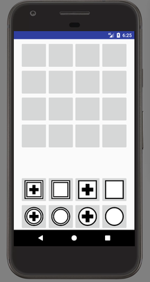
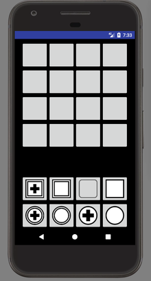
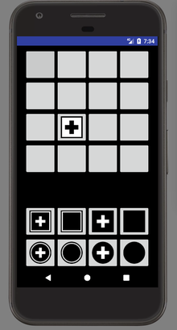
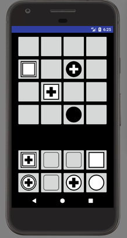
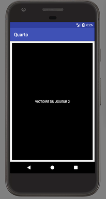

# Quarto

## Introduction

Le but de ce projet sera l'implémentation pour Android du jeu [Quarto](https://fr.wikipedia.org/wiki/Quarto).

### Les règles du Quarto

Le jeu est composé

 * d'un plateau du jeu de 4x4 cases
 * de 16 pièces: noire ou blanche, ronde ou carrée, a bordure doulbe ou non, contenant une croix ou non.

A chaque tour:

 * Le premier joueur choisit une pièce de sa couleur et la donne à son adversaire qui la place sur le plateau.

Un joueur gagne si:

 * Il place la dernière pièce d'une ligne, colonne ou diagonale dont les 4 pièces possèdent une caractéristique commune. (Toutes de la même couleur, toutes de la même forme, etc...) 

### Objectifs

L'application finale sera composée d'au moins:

 * Un **Menu** qui servira d'écran d'accueil et qui permettra de lancer une partie.


 * Une fois dans la partie le **Plateau** de jeu ainsi que la main du joueur dont c'est le tour apparaîtront.








## Installation d'Android studio

### Objectifs

 * Installer Android studio

### Détails

 * Activez dans le BIOS les options de virtualisation
 * Ouvrez un terminal est installer les packets nécéssaires pour l'émulateur Android (AVD)
```
sudo apt-get install qemu-kvm libvirt-bin ubuntu-vm-builder bridge-utils
```
La commande

```
sudo kvm-ok
```
devrait maintenant retourner:
```
INFO: /dev/kvm exists
KVM acceleration can be used
```
 * Installer Android studio

[Télécharger l'archive](https://developer.android.com/studio/index.html)

Décompressez la, ouvrez un terminal dans le dossier extrait, et lancez
```
./bin/studio.sh
```


## Hello World!

### Objectifs

 * Créer un première application contenant le message "Hellow World!" et la lancer sur un appareil virtuel.

### Détails

 * Voir sur [OpenClassroom](https://openclassrooms.com/courses/developpez-une-application-pour-android/)

## Menu

### Objectifs

 * Créer une application contenant deux activité. Un bouton présent sur la première permet, une fois activé de passer à la seconde.
 * Utiliser le Moniteur Android pour logger le comportement de l'application.


### Détails

 * Voir sur [OpenClassroom](https://openclassrooms.com/courses/developpez-une-application-pour-android/)

#### Event Listener

```java

    Button playButton = (Button) findViewById(R.id.bouton_jouer);
	// findViewById permet de récuperer l'objet correspondant à une vue

    playButton.setOnClickListener(new View.OnClickListener() {
        @Override
        public void onClick(View v) {
			//On peut mettre ici toutes les actions à déclancher quand on appuit sur playButton
        }
    });
```
#### Nouvelle activitée

```java
	//Ici on lance une nouvelle activitée nommée Plateau
    Intent transition = new Intent(this, Plateau.class);
    startActivity(transition);
```


## Plateau

### Objectifs

 * Afficher plateau, boutons et images


### Détails

 * Les images des pièces se trouvent dans `img/pieces`
 * Un layout de type TableLayout et des Widgets de type ImageButton peuvent être utilisés.


## Premier coup

### Objectifs

 * Créer les event listener sur la main pour récupérer la pièce choisie
 * Créer les event listener sur le plateau pour récupérer la position
 * Effacer la pièce de la main (et rendre le bouton vide non clickable)
 * L'afficher sur le plateau (et rendre la case non clickable)


### Détails


```java
	//Changer l'image d'un bouton
    button.setImageResource(myImage);

	//centrer l'image
    button.setScaleType(ImageView.ScaleType.FIT_CENTER);

	//Rendre le bouton non clickable
    button.setClickable(false);
```
Lorsque l'on a plusieurs boutons du même type et/ou que l'on souhaite leur faire déclancher des actions qui dépendent du boutons, il n'est pas très pratique de déclarer les event listener un par un. Dans ce cas on peut déclarer une classe qui implémente View.OnClickListener comme ceci: 

```java
	class CaseListener implements View.OnClickListener {
        int x, y;

        public CaseListener(int x, int y) {
            this.x = x;
            this.y = y;
        }

        @Override
        public void onClick(View v) {
            //Actions dépendant de x et y
        }
    }
```
On peut par la suite l'utiliser comme ceci

```java
	pieceButton[1][3].setOnClickListener(new CaseListener(1,3));
```

## Logique du jeu

### Objectifs


 * Récupérer les images, les boutons de la main et du plateau et les mettre dans des tableaux pour y acceder facilement depuis le code.

 * Les classes Piece, Joueur, Partie

 * Les machines à état ([Aide ici](Machine.md))


## Améliorations

### Objectifs

 * Ajouter un ecran de victoire


 * Ajouter un son et/ou une vibration lorsqu'une pièce est posée.


 * Changer la couleur du fond en fonction du joueur don c'est le tour.

 * Remplacer la vue de la main du joueur qui a choisi la pièce, lorsque son adversaire doit la pauser, par la pièce en question seule.

## En ligne

### Objectifs

A venir


