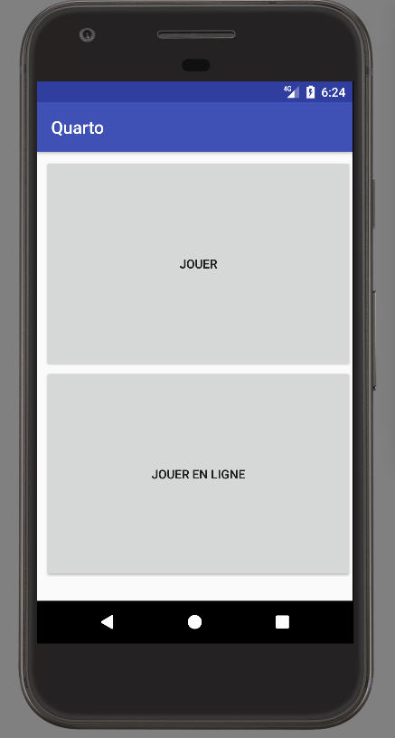
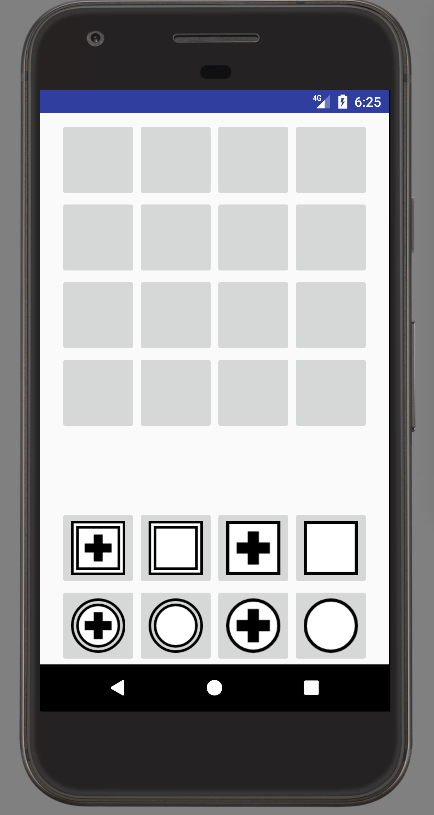
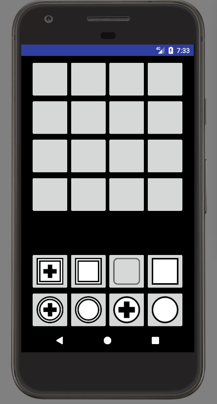
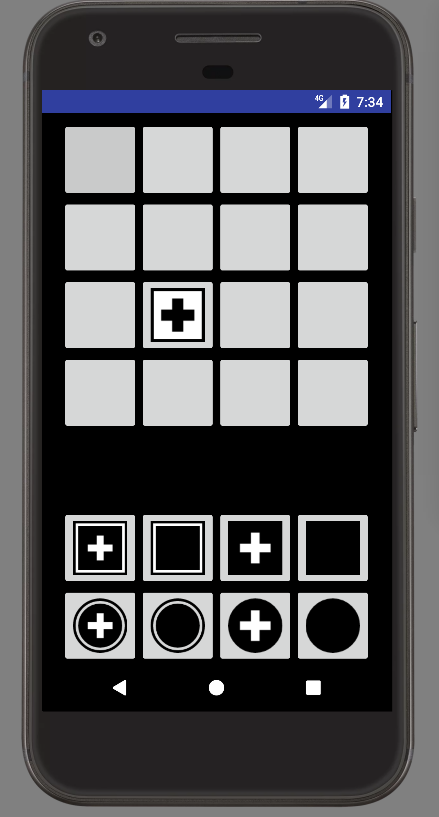
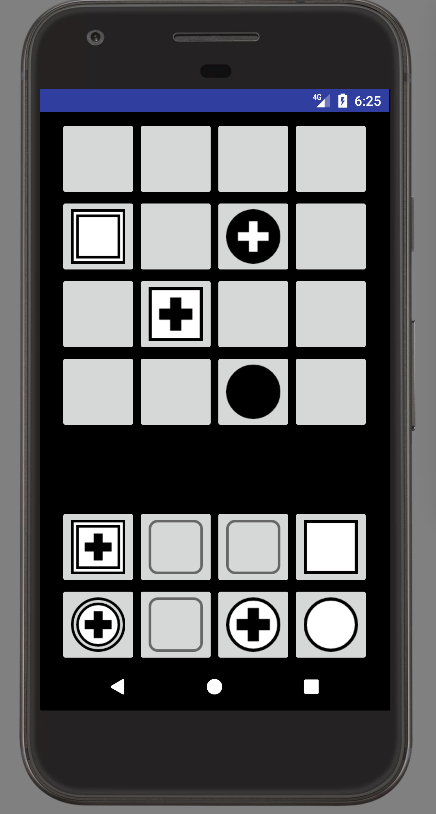
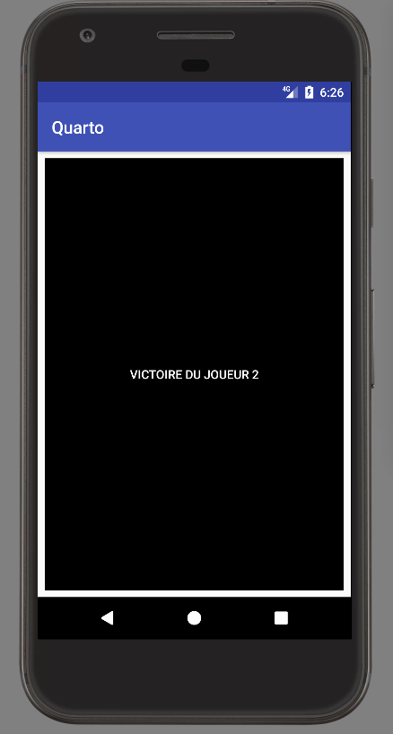

# Quarto

## Introduction

Le but de ce projet sera l'implémentation pour Android du jeu Quarto.

### Les règles du Quarto

Le jeu est composé

 * D'un plateau du jeu de 4x4 cases
 * 16 pièces: noire ou blanche, ronde ou carrée, a bordure doulbe ou non, contenant une croix ou non.

A chaque tour:

 * Le premier joueur choisit une pièce de sa couleur et la donne à son adversaire qui la place sur le plateau.

Un joueur gagne si:

 * Il place la dernière pièce d'une ligne, colonne ou diagonale dont les 4 pièces possèdent une caractéristique commune. (Toutes de la même couleur, toutes de la même forme, etc...) 

### Objectifs

L'application finale sera composé d'au moins:

 * Un **Menu** qui servira d'écran d'accueil et qui permettra de lancer une partie.



 * Une fois dans la partie le **Plateau** de jeu ainsi que la main du joueur dont c'est le tour apparaîtront.








## Installation d'Android studio

### Objectifs

 * Installer Android studio

### Détails

 * Activez dans le bios les options de virtualisation
 * Ouvrez un terminal est installer les packets nécéssaires pour l'émulateur Android (AVD)
```
sudo apt-get install qemu-kvm libvirt-bin ubuntu-vm-builder bridge-utils
```
La commande

```
sudo kvm-ok
```
devrait maintenant retourner:
```
INFO: /dev/kvm exists
KVM acceleration can be used
```
 * Installer Android studio

[Télécharger l'archive](https://developer.android.com/studio/index.html)

Décompressez la, ouvrez un terminal dans le dossier extrait, et lancez
```
./bin/studio.sh
```


## Hello World!

### Objectifs

 * Créer un première application contenant le message "Hellow World!" et la lancer sur un appareil virtuel.

### Détails

 * Voir sur [OpenClassroom](https://openclassrooms.com/courses/developpez-une-application-pour-android/)

## Menu

### Objectifs


### Détails

 * Voir sur [OpenClassroom](https://openclassrooms.com/courses/developpez-une-application-pour-android/)


## Plateau
### Objectifs
 * Afficher plateau, boutons et images


### Détails

 * Les images des pièces se trouvent dans `img/pieces`

## Premier coup

### Objectifs


## Logique du jeu
### Objectifs


 * Les classes Piece, Joueur, Partie
 * Les event listener
 * Les machine à Etat


## Améliorations
### Objectifs

Son, boucler le menu, etc


## En ligne
### Objectifs

A venir


